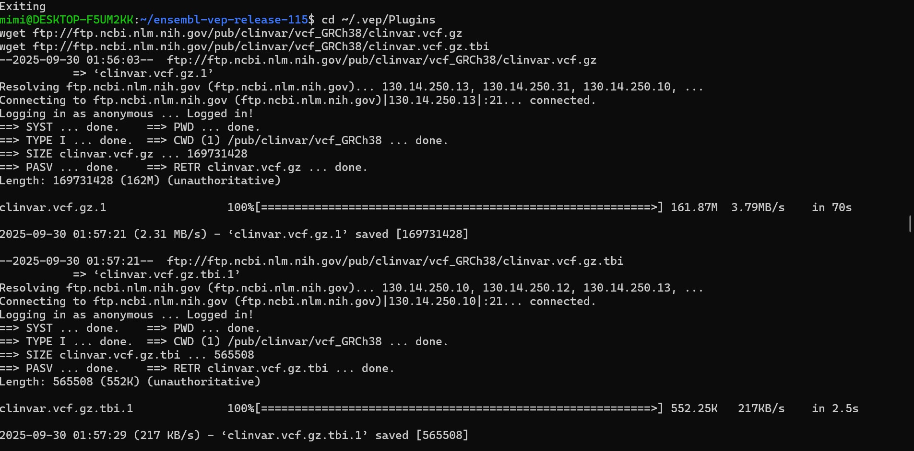

# Genomics Annotation with VEP

Assignment 1: Genomics Annotation with VEP
Introduction

This assignment demonstrates how to annotate and analyze genetic variants from VCF files. We combine:
VEP annotation for biological context and Python analysis to summarize and interpret results

Background
VCF Files are the standard format for storing genetic variants (SNPs, insertions, deletions)It contains chromosome, position, alleles, and optional metadata
Variant Annotation adds biological meaning: gene affected, transcript consequences, clinical relevance

1. VEP Setup

* Installed VEP locally
* Downloaded and configured local cache/database files for     GRCh38
* Annotated VCF files

Python Analysis

A Python script (`annotate_vcf.ipynb`) was developed to parse and analyze annotated VCFs.

The script performs:

* a.Count total variants in annotated VCF
* b.Count unique genes
* c.Count unique traits/disease conditions
* d.List pathogenic/likely pathogenic variants
* e.Per chromosome:

  * Count total variations
  * Count SNP IDs
  * Identify variants without SNP IDs
  * Generate a comprehensive log file (`vcf_analysis_log.txt`) with all results

Results

* Annotated VCF files generated for two samples
* Extracted summary statistics:

  * Total number of variants
  * Number of unique genes affected
  * Number of unique traits/diseases linked
  * A list of pathogenic variants
  * Per-chromosome variant summary
* Comprehensive results written to `vcf_analysis_log.txt`

Example Output (from Notebook)

`results = parse_vep_vcf("sample1_annotated.vcf")

print("Total Variants:", results["total_variants"])
print("Unique Genes:", len(results["unique_genes"]))
print("Unique Traits:", len(results["unique_traits"]))

display(results["per_chrom"].head())
display(results["pathogenic_variants"].head())``

Conclusion

This assignment demonstrates a reproducible workflow for variant annotation

                  

```mermaid
`graph TD
A[Start: Input VCF file] --> B[Parse VCF & prepare for annotation]
B --> C[Run VEP annotation]
C --> D[Apply ClinVar plugin]
D --> E[Generate annotated VCF]
E --> F[Parse annotated VCF in Python]
F --> G[Extract genes, traits, pathogenic variants]
G --> H[Summarize per chromosome]
H --> I[Save logs & CSV outputs]
I --> J[End]`

---

````markdown
# VEP Pipeline Overview

```mermaid
graph TD
A[Start: Input VCF file] --> B[Parse VCF & prepare for annotation]
B --> C[Run VEP annotation]
C --> D[Apply ClinVar plugin]
D --> E[Generate annotated VCF]
E --> F[Parse annotated VCF in Python]
F --> G[Extract genes, traits, pathogenic variants]
G --> H[Summarize per chromosome]
H --> I[Save logs & CSV outputs]
I --> J[End]
```

Step 2: Add a section with Linux commands

Use **Markdown code blocks** to show the commands you executed:

```markdown
# Commands Executed

## Install dependencies
```bash
sudo apt update
sudo apt install -y perl curl wget gzip unzip libdbi-perl libdbd-mysql-perl libarchive-zip-perl libwww-perl
````

## Download and unzip VEP

```bash
cd ~
unzip /mnt/c/Users/other\ user/Downloads/ensembl-vep-release-115.zip
cd ensembl-vep-release-115
```

## Download ClinVar plugin

```bash
mkdir -p ~/.vep/Plugins
cd ~/.vep/Plugins
curl -O https://ftp.ncbi.nlm.nih.gov/pub/clinvar/vcf_GRCh38/clinvar.vcf.gz
curl -O https://ftp.ncbi.nlm.nih.gov/pub/clinvar/vcf_GRCh38/clinvar.vcf.gz.tbi
```

## Run VEP with ClinVar plugin

```bash
cd ~/ensembl-vep
./vep -i "/home/mimi/test1_data 1.vcf" \
      -o "/home/mimi/test1_data_annotated.vcf" \
      --species homo_sapiens \
      --assembly GRCh38 \
      --custom ~/.vep/Plugins/clinvar.vcf.gz,ClinVar,vcf,exact,0,CLNSIG,CLNDN
```

## Check output

```bash
head -n 50 /home/mimi/test1_data_annotated.vcf
grep -c "CLNSIG=" /home/mimi/test1_data_annotated.vcf
```

Step 3:Python analysis

```markdown
# Python VEP Parsing

```python
import pandas as pd

# Parse annotated VCF
results = parse_vep_vcf("/mnt/c/Users/other user/Downloads/test1_data_annotated.vcf")
print("Total Variants:", results["total_variants"])
print("Unique Genes:", len(results["unique_genes"]))
print("Unique Traits:", len(results["unique_traits"]))
```

```bash
git add README.md
git commit -m "Add VEP pipeline flowchart and executed commands"
git push
````
