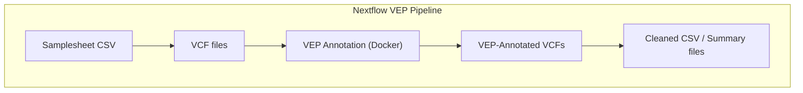

** VEP Annotation Nextflow Pipeline**

This Nextflow pipeline annotates VCF files using Ensembl VEP (Variant Effect Predictor) and Docker. It is designed for running in a reproducible, containerized environment using nf-core standards.

Workflow Objective

The pipeline takes one or more VCF files as input and produces VEP-annotated VCFs with transcript- and variant-level annotations.

Input

The pipeline requires the following command-line parameters:


| Parameter       | Type   | Description                                                          |
| --------------- | ------ | -------------------------------------------------------------------- |
| `--samplesheet` | file   | CSV file containing sample metadata and VCF paths (see format below) |
| `--outdir`      | string | Directory to store all outputs                                       |

---

Samplesheet Format

The `samplesheet.csv` should have at least the following columns:

| Column             | Description                                       |
| ------------------ | ------------------------------------------------- |
| `sample_id`        | Unique sample identifier                          |
| `vcf_path`         | Full or relative path to the input VCF file       |
| `vcf_tumor_sample` | Tumor sample name as it appears in the VCF header |

Input file format:

```csv
sample_id,vcf_path,vcf_tumor_sample
Sample_001,data/vcfs/sample_001.vcf.gz,TUMOR_SAMPLE_001
Sample_002,data/vcfs/sample_002.vcf.gz,TUMOR_SAMPLE_002
```

Output

For each sample, the workflow aims to produce:

1. VEP-annotated VCF files
2. Optional cleaned CSV files containing key annotations for downstream analysis

The directory structure under `--outdir` will look like:

```
results/
├── vep_annotated_vcfs/     # Annotated VCF files
├── clean_vcfs/             # Processed VCFs and CSV summaries
```

---

Running the Pipeline

With Docker:

```bash
nextflow run main.nf -profile docker \
  --samplesheet 'samplesheet.csv' \
  --outdir 'results'
```


Errors shown:

* Permission denied in `.command.sh`
* Unable to figure out the root cause


---

 Errors made and how they were corrected:


1. Permission fix

```bash
chmod +x ./*
```

* Attempted to make scripts executable.

2. Running manually in work dir

```bash
bash .command.run
```

* Revealed the actual error: `vep: command not found`.

3. Checking VEP input files

```bash
ls -l /home/mimi/nextflow-vep/input_vcfs/test*.vcf
```

* Verified VCF files exist and have correct permissions.

4. Navigating and cleaning folders

* Tried moving `nextflow_project` to a backup folder.
* Checked folder paths using `find` and `ls -l`.

5. Running Nextflow with Docker

```bash
nextflow run ../ensembl-vep-release-115/main.nf \
    --samplesheet samplesheet.csv \
    --outdir results \
    -with-docker ensemblorg/ensembl-vep:release_115 \
    -resume
```

* Attempted to force correct Docker image (`release_115`) to fix VEP not found.

---


---
Workflow Diagram


